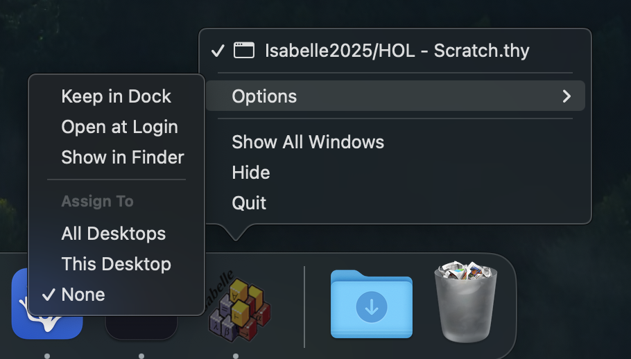
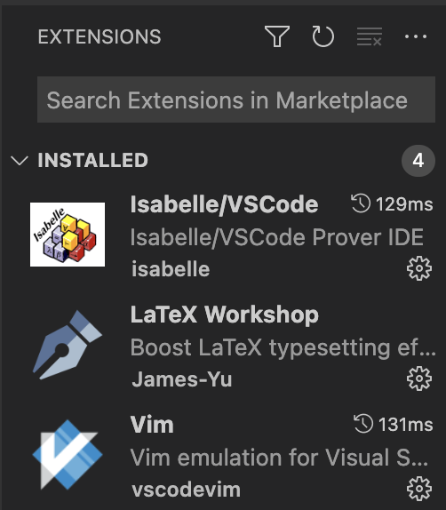

+++
date = '2025-09-13T23:58:40-04:00'
draft = false
title = 'How To Set Up Isabelle On VSCode (Mac)'

summary = "A quick tutorial to open isabelle on a VSCode style editor"
description = "A quick tutorial to open isabelle on a VSCode style editor"
readTime = false
autonumber = false
math = false
hideBackToTop = false
tags = ['isabelle', 'proof', 'vscode']
showTags = false
fediverse = "@geoc@mathstodon.xyz"
+++

> System OS: macOS Sequoia 15.6.1 | Isabelle Version: Isabelle2025

I was trying to look for any documentation on how to set up Isabelle on VSCode but couldn't find any good resources, so I decided to write a quick tutorial for anyone else who might be looking for it.

## Locating the Isabelle Binary

We first want to find our Isabelle binary located in our Isabelle app. Typically this should be installed in the home `Applications` folder but could also be in our user `Applications` folder:

- Open up terminal and try:

```bash
cd ~/../../../Applications/Isabelle2025.app/bin/
```

If that doesn't work, then try:

```bash
cd ~/Applications/Isabelle2025.app/bin/
```

This is using your user's applications folder.

Alternatively, if that doesn't work, try finding where your Isabelle application is located and try moving it to your applications folder and redo the last commands.

You can find it by right clicking the Isabelle application in the dock and clicking `Show in Finder`.



## Adding isabelle to $PATH

So now that we're in the directory where our isabelle binary is, we can add the directory to `$PATH` the environment variable that the shell uses to pull any commands we have available to us.

We can do that with:
```bash
echo "export PATH=\"$(pwd):\$PATH\"" >> ~/.zshrc
```

## Using isabelle with VSCode

Now, after restarting your shell, you can use the command `isabelle vscode` in your terminal instead of `code` to edit isabelle files. For example, if I'm in the directory my isabelle files are in. I can just run `isabelle vscode .` to open the directory.

You now may want to include some of the extensions you use in your normal VSCode Sessions <span class="annotation__text" data-annotation="I also haven't gotten themes to work">though it's a bit limited</span>:




You can also see the isabelle infoview by opening the command pallet and then searching for `isabelle: output`.
