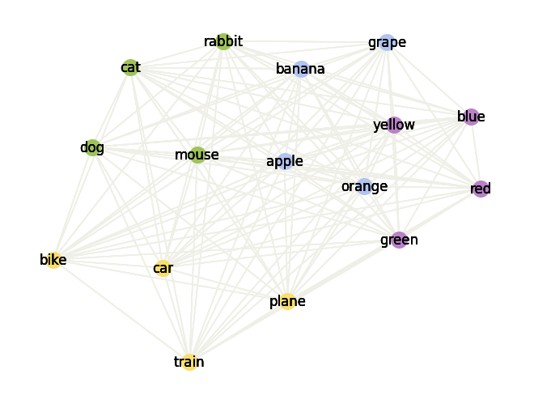
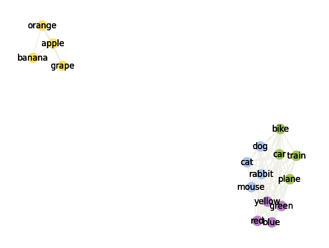
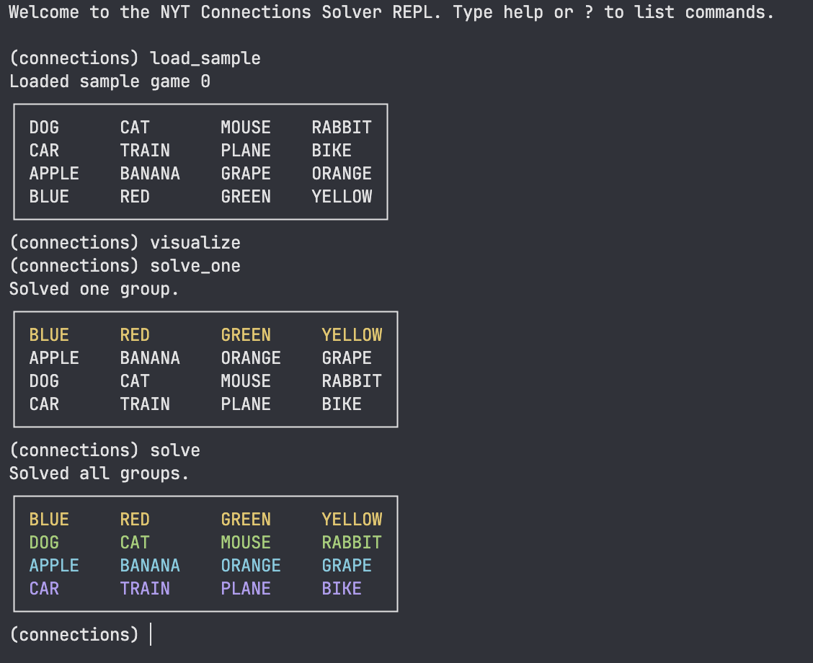

+++
title = "NYT Connections Solver"
date = "2025-05-22"
draft = false

summary = "Solving the NYT Connections using graph partitioning and word vectors"
description = "Solving the NYT Connections using graph partitioning and word vectors"
readTime = false
autonumber = false
math = false
tags = ["data", "word-vector", "spectral-graph-theory"]
showTags = false
hideBackToTop = false
fediverse = "@geoc@mathstodon.xyz"
+++

Me and some friends had gotten so stuck on a NYT Connections game that we decided to draw a graph of the words on a whiteboard to see the possible connections. Immediately after drawing it we realized that we could use some of our knowledge in [spectral graph theory](../../projects/spectral_graph_theory) to solve the game. There's a technique called spectral clustering that uses the eigenvalues and eigenvectors of the Laplacian matrix of a graph to find the best partitioning of the graph. We could also use the similarity between the words for the weights of the edges in the graph to improve the performance of the solver.

I thought it would be a fun project to implement this idea and here's the result with a small demo:

*After solving the first connection*

## How it works:
### Word Vectors
Words can be expressed as vectors using a technique called word vectors or word embeddings. The idea is that instead of representing words as one-hot vectors or just as strings of characters, we can represent them as vectors in a high-dimensional space, allowing us to capture some of the semantic meaning of the words. For example, the word "king" might be represented as a vector that is close to the vector for "queen", and far away from the vector for "car". Moreover, we can combine these vectors to create new vectors that represent the meaning of the combination of the words. For example, the vector for "queen" minus "king" might be close to the vector for "women" minus "man". This allows us to better compare the words and find similarities between them. This is typically the first step to setting up data for NLP/LLM models. 

We can use pre-trained word vectors from the `spacy` library, and we can also train our own word vectors on some data from the NYT Connections game, which should help our model to better understand what type of connections are made in the game.

### Graph Partitioning
The idea is to represent the words as a graph, where each word is a node and the edges between them are the cosine similarity between the word vectors. The goal is to partition the graph into 4 groups of 4 words each, such that the words in each group are more similar to each other than to the words in the other groups. This is done using a technique called spectral clustering, which uses the eigenvalues and eigenvectors of the Laplacian matrix of the graph to find the best partitioning of the graph. 

## Results

### Using the Base Word Vectors
Here's a small demo using the text interface

### Using the Trained Word Vectors
Here we have trained the model on the NYT Connections game data to improve the performance of the solver on more difficult games. The model is trained on the NYT Connections game data, which consists of a small number of games, so maybe more data is needed to improve the performance of the model. The training runs for a few epochs (1 minute) and then the model is used to solve the game. 

<h2><a href="https://github.com/Geoc2022/nyt-connections-solver">Repo</a> </h2>
