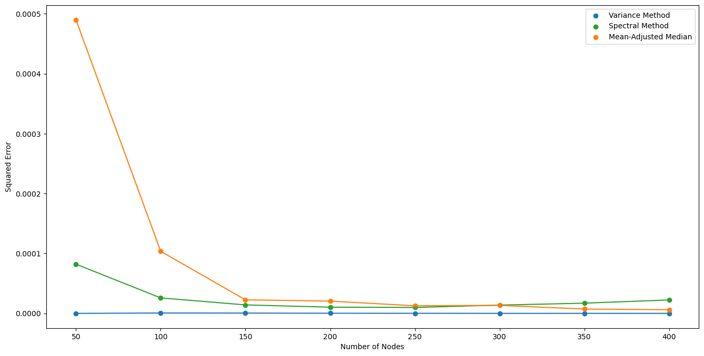
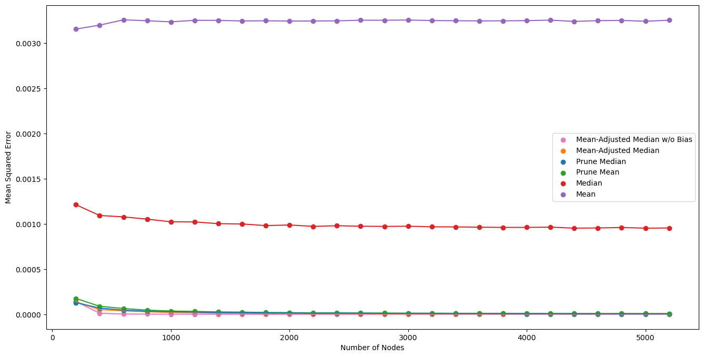
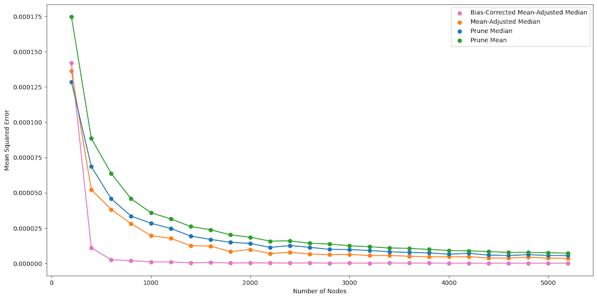
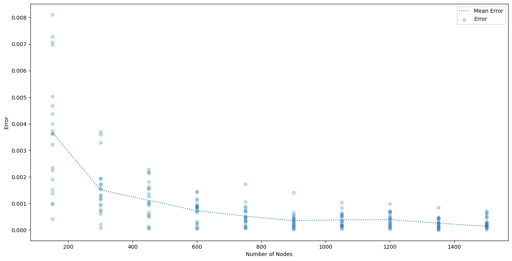

+++
title = "Robust Estimation for the Erdős-Rényi Model"
date = "2024-12-07"
draft = false

summary = "Final project for CSCI 2952Q: Robust Algorithms in Machine Learning"
description = "Robust estimation of edge probabilities in Erdős-Rényi graphs under adversarial perturbations. "
readTime = false
autonumber = false
math = true
tags = ["graph-theory", "robustness", "random-graphs", "machine-learning", "csci2952q", "spectral-graph-theory"]
showTags = false
hideBackToTop = false
fediverse = "@geoc@mathstodon.xyz"
+++

This project was completed as part of the course [CSCI 2952Q: Robust Algorithms in Machine Learning](https://cs.brown.edu/people/ycheng79/csci2952qf24.html) at Brown University. We study the problem of estimating the edge formation probability $p$ in an Erdős-Rényi random graph under adversarial perturbations.

We introduce the $(q, \epsilon)$-adversarial model, which generalizes existing frameworks by allowing varying levels of adversarial knowledge (oblivious to omniscient) and control over a fraction $\epsilon$ of corrupted vertices. Within this setting, we propose new algorithms that achieve improved performance in both runtime and robustness.

## Methods

### Mean-Adjusted Median

This estimator is based on the observation that the median of the degree distribution is more robust to outliers than the mean in the presence of an oblivious adversary. By comparing the median and mean of the degree distribution, and applying a corrective adjustment, we estimate $p$ in $O(n)$ time with provable error guarantees:

$$
|p - \hat{p}| \leq O(n^{-1/4}) \quad \text{with high probability}.
$$

### Bias-Corrected Mean-Adjusted Median

We extend the previous method to account for a bias term that depends on $n$, $\epsilon$, $p$, and $q$. The corrected estimator removes this bias without requiring knowledge of $p$ or $q$, and retains the same linear runtime.

### Variance-Based Filtering

We propose an iterative filtering algorithm that removes corrupted vertices based on their contribution to the deviation in empirical degree variance. The algorithm identifies uncorrupted subgraphs where the degree distribution better matches the expected binomial variance. This method has runtime $O(\epsilon n^3)$, and performs well in practice. Theoretical guarantees remain a direction for future work.

**Input:** Laplacian matrix $L$, parameter $\epsilon$  
**Output:** Filtered vertex set $V$

1. Let $n \gets$ number of vertices  
2. Initialize $V \gets$ set of all vertices  

3. For $t = 0$ to $\epsilon n - 1$:  
   1. For each vertex $v \in V$:  
      - Compute the subgraph $G_{V \setminus \{v\}}$ by removing vertex $v$ from $V$  
      - Compute and store the value  
      $$
      \left| s^2_{G_{V \setminus \{v\}}} - \hat{\sigma}^2_{G_{V \setminus \{v\}}} \right|
      $$
   2. Find  
   $$
   x \gets \arg\max_{v \in V} \left| s^2_{G_{V \setminus \{v\}}} - \hat{\sigma}^2_{G_{V \setminus \{v\}}} \right|
   $$
   3. Update vertex set:  
   $$
   V \gets V \setminus \{x\}
   $$
4. Return $V$

## Empirical Results

<!-- \begin{figure}[ht]
    \centering
    % First row with two figures
    \begin{minipage}{0.45\textwidth}
        \centering
        \includegraphics[width=\linewidth]{latex//img/emperic.png}
        \caption{$\eps=0.1$, $p = 0.3$, $q = 0.6$}
        \label{fig:result1}
    \end{minipage} \hfill
    \begin{minipage}{0.45\textwidth}
        \centering
        \includegraphics[width=\linewidth]{latex//img/emperic2.png}
        \caption{$\eps = 0.1$, $p = 0.3$, $q = 0.6$}
        \label{fig:result2}
    \end{minipage}
\end{figure}

\begin{figure}[ht]
    % Second row with two figures
    \begin{minipage}{0.45\textwidth}
        \centering
        \includegraphics[width=\linewidth]{latex/img/emperic3.png}
        \caption{$\eps = 0.01$, $p = 0.3$, $q = 0.6$}
        \label{fig:result3}
    \end{minipage} \hfill
    \begin{minipage}{0.45\textwidth}
        \centering
        \includegraphics[width=\linewidth]{latex/img/emperic4.png}
        \caption{Each dot represents a trial; $\eps = 0.1$, $p = 0.3$, $q = 0.6$}
        \label{fig:result4}
    \end{minipage}
\end{figure} -->

<!-- 

    

        
        
 $\varepsilon=0.1$, $p = 0.3$, $q = 0.6$

    

    

        
        
 $\varepsilon = 0.1$, $p = 0.3$, $q = 0.6$

    

    

        
        
 $\varepsilon = 0.01$, $p = 0.3$, $q = 0.6$

    

    

        
        
 Each dot represents a trial; $\eps = 0.1$, $p = 0.3$, $q = 0.6$

    

 -->

<!-- |  |  |
|:-----------------------------------------:|:------------------------------------------:|
| $\varepsilon=0.1$, $p = 0.3$, $q = 0.6$   | $\varepsilon = 0.1$, $p = 0.3$, $q = 0.6$  |
|  |  |
| $\varepsilon = 0.01$, $p = 0.3$, $q = 0.6$| Each dot represents a trial; $\varepsilon = 0.1$, $p = 0.3$, $q = 0.6$ | -->

$\varepsilon=0.1$, $p = 0.3$, $q = 0.6$

$\varepsilon = 0.1$, $p = 0.3$, $q = 0.6$

$\varepsilon = 0.01$, $p = 0.3$, $q = 0.6$

Varience Method: Each dot represents a trial; $\varepsilon = 0.1$, $p = 0.3$, $q = 0.6$

## Comparison of Methods

| Method                 | Runtime                   | Authors        |
| ---------------------- | ------------------------- | -------------- |
| Mean/Median            | $O(n)$                    | Acharya et al. |
| Prune then Mean/Median | $O(n \log(\epsilon n))$   | Acharya et al. |
| Spectral Method        | $\tilde{O}(\epsilon n^3)$ | Acharya et al. |
| Mean-Adjusted Median   | $O(n)$                    | Lee et al.     |
| Bias-Corrected M.A.M.  | $O(n)$                    | Lee et al.     |
| Variance Method        | $O(\epsilon n^3)$         | Lee et al.     |

## Repository

The full codebase, including implementation and experiments, is available here:

* [GitHub Repository](https://github.com/Geoc2022/2952Q_FinalProject)
* [Final Report (PDF)](https://github.com/Geoc2022/2952Q_FinalProject/report/final.pdf)
* [Presentation Slides](https://github.com/Geoc2022/2952Q_FinalProject/presentation/CSCI2952Q_Presentation.pdf)

The repository contains:

* `algos.py`: Implementation of robust estimation methods.
* `var_adversary.py`: Code for simulating adversarial perturbations.
* `figures.ipynb`: Reproducible plotting scripts.
* `report/`: LaTeX sources for the paper.

This work contributes novel algorithms to the problem of robust estimation in random graphs, and provides both theoretical analysis and practical validation.

