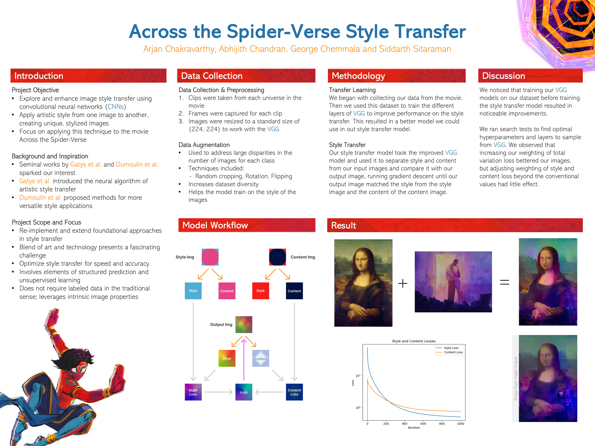

+++
title = "Across the Spider-Verse Style Transfer"
date = "2023-05-19"
draft = false

summary = "A style transfer project using CNNs to recreate the visual style of *Across the Spider-Verse*"
description = "A style transfer project using CNNs to recreate the visual style of *Across the Spider-Verse*"
readTime = false
autonumber = false
math = true
tags = ["deep-learning", "style-transfer", "cnn", "computer-vision", "spiderverse"]
showTags = false
hideBackToTop = false
fediverse = "@geoc@mathstodon.xyz"
+++

For our Deep Learning project, we recreated the universe styles of *Spider-Man: Across the Spider-Verse* using neural style transfer. Building on foundational work by [Gatys et al.](https://arxiv.org/abs/1508.06576) and [Dumoulin et al.](https://arxiv.org/abs/1610.07629), we aimed to improve the style transfer pipeline by fine-tuning a CNN on frames taken directly from the movie. This helped us tailor the model’s internal representations to the kinds of textures, patterns, and colors that define the film’s look. We esseintally combined transfer learning with style transfer, which had not been  done in the literature before.

### From Transfer Learning to Style Transfer

We began by adapting the VGG network through transfer learning. To do this, we trained a classifier that could distinguish between five different universes featured in the movie, using curated frames as our dataset. The goal wasn’t classification accuracy—rather, we wanted to tune the network’s convolutional layers so they’d better reflect the visual features of the Spider-Verse.

Once trained, we used this CNN as a backbone for the style transfer model. We created a `StyleContentModel` class that extracts features from selected layers—style layers sampled across the network, and a content layer from deeper in the architecture. For the style features, we computed Gram matrices to capture texture information, while content loss was based on mean squared differences between higher-level features.

These components were then used in a second class, `StyleTransfer`, which applies gradient descent directly to a copy of the content image. Over multiple iterations, the image is adjusted to match the style and content targets simultaneously.

### Results

