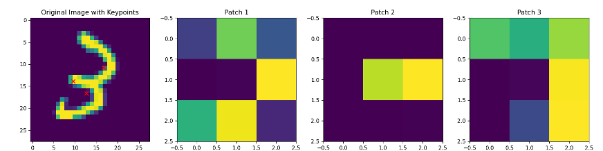
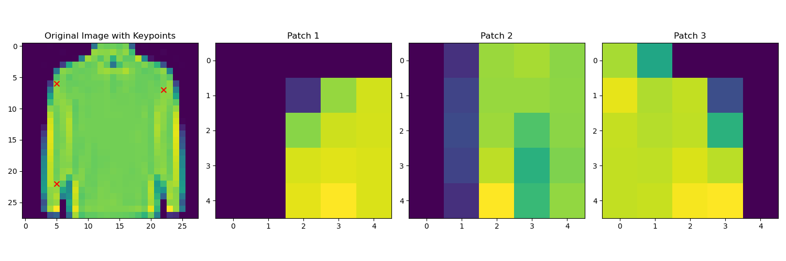
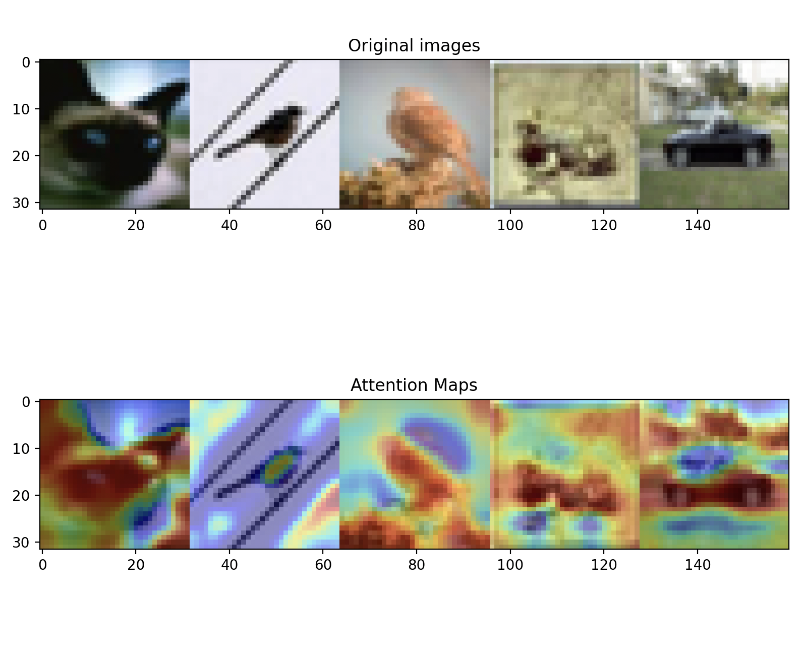

+++
title = "Unboxing the Black Box"
date = "2025-05-09"
draft = false

summary = "Human-Inspired CNNs for Explainability and Efficiency"
description = "Human-Inspired CNNs for Explainability and Efficiency"
readTime = false
autonumber = false
math = false
tags = ["cnn", "explainability", "computer-vision"]
showTags = false
hideBackToTop = false
fediverse = "@geoc@mathstodon.xyz"
+++

Convolutional Neural Networks (CNNs) have become essential in computer vision, but they often function as black boxes—highly accurate, but opaque and computationally expensive. This project explores a key question:

**Can we design CNNs that are more interpretable and efficient, while maintaining competitive accuracy, by mimicking how humans focus attention?**

Inspired by human visual attention, we developed two complementary strategies aimed at improving both the **efficiency** and **explainability** of CNNs.

---

## Problem

Humans don’t process entire scenes at once—we focus on the most informative parts. Traditional CNNs, by contrast, process full images in detail, regardless of which regions are actually relevant for the task. This approach is not only inefficient but also makes it difficult to interpret how the model reaches its decisions.

For example, when classifying a picture of a dog vs a cat, a human would likely focus certain areas like the ears (pointy = cat, floofy = dog), rather than the entire background. 

  

    

      
    

    

      
      Von.grzanka CC BY-SA 3.0
    

  

Our goals:

1. Reduce the computational cost of image classification by focusing only on important regions.
2. Improve model transparency by making it clear which parts of the input influence predictions.

---

## Our Approach

We implemented two types of models, both inspired by how humans visually process scenes:

### Focus-Based CNNs

These models isolate key regions of the image and classify based on those subregions alone. We explored two variants:

* **Learned focus model**: Learns salient keypoints during training and extracts patches around them.
* **Corner focus model**: Uses Harris corner detection to identify high-curvature points, then extracts surrounding patches.

Both aim to cut down on unnecessary computation and make the decision process more interpretable.

### Attention-Based CNNs

These models maintain a standard CNN architecture but extract intermediate features from early and late layers to build attention maps. These maps are merged with the main features before classification, helping visualize which parts of the image the model relies on.

---

## Results

We tested our models on MNIST, Fashion-MNIST, and CIFAR-10. Below are some qualitative and quantitative results:

### Sample Outputs

* **Learned Focus on MNIST**
  
  Keypoints align with digit-defining regions, such as the curves of the number 3.

* **Corner Focus on Fashion-MNIST**
  
  Keypoints focus on structural parts like shoulders and sleeve ends.

* **Attention on CIFAR-10**
  
  Heatmaps reveal focus on foreground objects such as animals and vehicles.

### Performance Summary

| Model         | MNIST | Fashion | CIFAR |
| ------------- | ----- | ------- | ----- |
| Focus-learned | 98%   | 86%     | 52%   |
| Focus-corners | 86%   | 72%     | 34%   |
| Attention     | —     | —       | 79%   |

| Model           | Efficiency |
| --------------- | ---------- |
| Focus (learned) | Medium     |
| Focus (corners) | High       |
| Attention-based | Low        |

* **Focus models** reduce computation and improve transparency by limiting input to selected regions.
* **Attention models** retain high accuracy and offer insight into the model's decision process through visualized attention.

